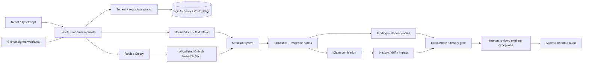

# Architecture

## Implemented boundaries

`backend/db.py` defines organization, user, repository, source grant, session, domain record, audit and delivery tables. Domain documents carry organization/repository foreign keys and kind/natural-key uniqueness. Claims/findings/evidence/edges/dependencies/snapshots/reviews/PRs/drift/jobs are versioned JSON documents within that relational scope. SQLAlchemy optimistic versions protect reviews.

`backend/domain.py` persists each analysis output transactionally. Source files are redacted before persistence; original content SHA-256 fingerprints enable snapshot identity and file reuse. Cache reuse requires identical file hash and analyzer version and is scoped to the authorized same-repository base snapshot. Deterministic verifier results are reused only when their full relevant input fingerprints match, including absence of evidence. Claims and findings keep stable scoped identities and snapshot version IDs; reviews carry only across unchanged evidence. Impact traverses stored reverse graph dependencies, including removed evidence. A rule-only upgrade with unchanged source creates analysis-change provenance rather than software drift.

`analyzers/engine.py` has no subprocess, importlib, exec, eval, source installation or network authority. It parses source with Python AST and bounded lexical rules. Imports/declarations support INFERRED results. Missing implementation evidence stays UNVERIFIED. A session configuration opposing a JWT declaration creates a scoped contradiction with limitations.

`integrations/github` owns temporary GitHub installation tokens and allowlisted HTTP transport. `workers/github.py` joins base/head analyses and optional advisory checks. Provider responses are never interpreted as executable instructions. The current environment has no configured live installation.

The local adapter uses SQLite and bounded synchronous imports by default. `JOB_MODE=celery` queues source imports and returns before analysis. Migration 0004 adds tenant/repository-scoped encrypted, expiring `AnalysisInput` rows. Queue messages contain job IDs. Worker completion/cancellation deletes retained input; Celery beat schedules expiry cleanup. Native stages commit before output construction; the evidence graph/snapshot output remains atomic. A tenant row lock serializes PostgreSQL admission quotas. Production middleware uses separate Redis atomic counters for login/import/analysis/Ask/webhook/provider/general admission and fails closed on Redis outage.

`workers/advisories.py` optionally checks exact versions against OSV with fixed transport, tenant cache, bounded provider budgets and explicit coverage. Findings merge manifest observations and preserve original provider identity, evidence links and human review. Gates and policy graph nodes are refreshed from current records and active exceptions.

Container PostgreSQL/Redis/Celery behavior is **unverified here because Docker, native PostgreSQL/Redis and installed WSL are unavailable**. Raw source object storage, normalized claim/graph tables, semantic hybrid/pgvector retrieval, multi-component discovery, weighted tenant scheduling, production metrics/tracing export and enterprise identity remain deferred. This is a tested local static-analysis product, not a production-ready platform claim.
