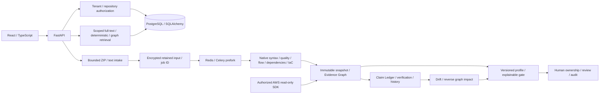

# ProjectTrace architecture — enterprise hardening candidate

The public route `/` and permanent Guide are separate from authorized `/app` and existing workspace routes. Forty-one public routes are statically rendered at build time, then hydrated when the current path matches. Public navigation reads only opaque auth flags. Workspace, query cache and graph code load lazily; private records remain inside the existing authorized API boundary. Shared theme, badge and source components keep the public/product interface consistent. Version 1.5.0 extends native observations and adds migration 0006 for quality projections. See [Public architecture](docs/PUBLIC_EXPERIENCE.md).

The modular monolith preserves relational organization/repository grants and JSON domain records. Migration 0005 adds NativeProfile and typed CloudAsset projections plus a PostgreSQL claim full-text GIN index. Profiles/asset projections share existing foreign keys and immutable snapshot evidence; complete normalized claim/graph schemas remain deferred.

Caches require file fingerprints/analyzer version and same-repository authorization; profile filters apply after observation caching. Snapshots record profile/version. Rule-only analysis changes are separate from software drift. Source redaction precedes persistence. Imported applications and templates are never executed.

Queues retain encrypted, scoped inputs with 72-hour expiry; messages contain only job IDs. Workers commit a claimed stage/125-second lease before analysis, then commit graph/snapshot output atomically. Terminal jobs, including PARTIAL, are idempotent. Late acknowledgements, prefork limits, visibility timeout and a 60-second recovery scheduler bound duplicate/crash recovery. Retained-input recovery is capped at two attempts. Redis production admission fails closed; PostgreSQL admission/recovery use row locks.

Real PostgreSQL 18.6, Redis 8.8.0 and a non-root Alpine Linux Celery 5.6.3 prefork worker were validated in a disposable QEMU VM, including natural lease recovery after a forced crash. This does not verify the supplied Docker images/Compose versions (PostgreSQL 17/Redis 7), production backup restore or sustained capacity. SQLite remains the explicit local adapter.

Native rules consume syntax primitives, never competitor finding services. Direct AWS reads are credential-gated; live-account verification is absent. OSV/GitHub remain optional authorized transports. Ask combines PostgreSQL full-text, deterministic evidence and stored graph neighborhoods; pgvector/embeddings are NOT_CONFIGURED. Enterprise identity, managed source object storage, full interprocedural analysis, multi-cloud fleets and runtime observations remain deferred. See [Final validation](FINAL_PRODUCT_VALIDATION.md).

## Native quality projection

`analyzers/code_quality` owns source classification, versioned rules/configuration, bounded normalized-token duplication, report parsing and quality gates. Python AST is shared by quality metrics/observations; bounded security flow analysis remains a separate AST pass. Isolated Tree-sitter workers supply syntax, parameter/nesting/contributor metrics and token observations for JavaScript, TypeScript/TSX and Java. Source never executes.

Migration 0006 adds `quality_analyses` (snapshot projection) and indexed `quality_occurrences` (authoritative finding record reference). Fingerprints exclude line offsets; review carry additionally checks observation/body context. Explicit BASE ancestry distinguishes removal and reintroduction, with a 200-snapshot bound and diagnostic. Renames create new identities. Rules/scope/analyzer changes establish a model baseline rather than reporting unrelated old identities as fixed.

Quality profile settings reuse NativeProfile and optimistic versions. Record findings/source/owners/function nodes/policy edges/PR impacts remain the shared Evidence Graph. Report imports and review events append provenance. Effective gate reads compose quality with existing security/claim decisions; stored snapshot results remain captured observations. No-source quality scopes are explicitly not applicable. Unsupported source/parser gaps yield partial coverage and review required.

The quality workspace requests lightweight context, paged findings/metrics/history and bounded 100-line source windows. Parser-observation caches are keyed by content, analyzer and parser signature inside scoped snapshots; profiles apply after raw observation reuse. Duplicate work stops at explicit token-window/pair/group budgets. Legacy small-input admission remains 1,000 entries / 10 MB / 512 KB per file. Streaming inventory admission separately defaults to 100,000 entries / 2 GB uncompressed / 512 MB archive, with 512 KB parser files and 100-file / 2 MB partitions. Binary/oversize metadata remains visible.

## Trust foundations in 1.6.0

Migration 0007 adds tenant policies, audit links/heads and explicit OIDC bindings/attempts plus nullable session membership binding. Existing domain records remain authoritative. Dedicated authorized trust/infrastructure projections avoid loading all historical source caches. IaC uses an owned bounded interpreter helper; Python AST remains in-process. See [enterprise operations](docs/ENTERPRISE_TRUST_OPERATIONS.md) and [validation](ENTERPRISE_TRUST_VALIDATION.md) for actual implemented/deferred architecture. This historical trust-foundation section is extended by the hardening architecture below; complete RLS/legacy compound tenant keys remain unimplemented.

## Additive enterprise hardening architecture

Migrations 0008–0013 add concept identities/occurrences, OIDC lifecycle, per-connection SCM scope, tenant-encrypted content inventories/parser artifacts, fenced fair queue claims/latest PR heads and graph indexes. Existing Record/Evidence Graph identities remain authoritative. RepositoryFiles lazily accesses captured content, metadata, hashes and components; typed file observations reuse content/path/parser/rule/IaC settings keys while gates, claims and cross-file correlations are recomputed. Source evidence decrypts only after repository authorization. S3-compatible storage is optional and stores ciphertext; legacy inline snapshots remain readable.

Queue admission and claims use short serialized transactions with distinct pending/running quotas. Round-robin tenants and repository ceilings govern eligible claims; generation tokens fence stale attempts, and latest PR heads supersede obsolete work. Recovery retries retained inputs; workers share scope/revocation checks. Graph nodes and neighborhoods are bounded, scoped projections with matching expression indexes. Thin BASE and workspace projections avoid deserializing all historical source caches.

Operator secret files, TLS-required production configuration, bounded helpers, signed checkpoint verification, consistent local encrypted recovery/key rotation and a restricted Kubernetes base support private evaluation. Production staging, whole-schema database tenant enforcement, complete helper network/filesystem sandbox and representative accuracy remain unverified. See ENTERPRISE_TRUST_VALIDATION.md and docs/PRIVATE_DEPLOYMENT_GUIDE.md.
