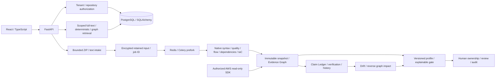

# ProjectTrace architecture 1.3.3

The modular monolith preserves relational organization/repository grants and JSON domain records. Migration 0005 adds NativeProfile and typed CloudAsset projections plus a PostgreSQL claim full-text GIN index. Profiles/asset projections share existing foreign keys and immutable snapshot evidence; complete normalized claim/graph schemas remain deferred.

Caches require file fingerprints/analyzer version and same-repository authorization; profile filters apply after observation caching. Snapshots record profile/version. Rule-only analysis changes are separate from software drift. Source redaction precedes persistence. Imported applications and templates are never executed.

Queues retain encrypted, scoped inputs with 72-hour expiry; messages contain only job IDs. Workers commit a claimed stage/125-second lease before analysis, then commit graph/snapshot output atomically. Terminal jobs, including PARTIAL, are idempotent. Late acknowledgements, prefork limits, visibility timeout and a 60-second recovery scheduler bound duplicate/crash recovery. Retained-input recovery is capped at two attempts. Redis production admission fails closed; PostgreSQL admission/recovery use row locks.

Real PostgreSQL 18.6, Redis 8.8.0 and a non-root Alpine Linux Celery 5.6.3 prefork worker were validated in a disposable QEMU VM, including natural lease recovery after a forced crash. This does not verify the supplied Docker images/Compose versions (PostgreSQL 17/Redis 7), production backup restore or sustained capacity. SQLite remains the explicit local adapter.

Native rules consume syntax primitives, never competitor finding services. Direct AWS reads are credential-gated; live-account verification is absent. OSV/GitHub remain optional authorized transports. Ask combines PostgreSQL full-text, deterministic evidence and stored graph neighborhoods; pgvector/embeddings are NOT_CONFIGURED. Enterprise identity, managed source object storage, full interprocedural analysis, multi-cloud fleets and runtime observations remain deferred. See [Final validation](FINAL_PRODUCT_VALIDATION.md).
