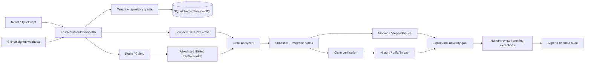

# Architecture

## Implemented boundaries

`backend/db.py` defines organization, user, repository, source grant, session, domain record, audit and delivery tables. Domain documents carry organization/repository foreign keys and kind/natural-key uniqueness. Claims/findings/evidence/edges/dependencies/snapshots/reviews/PRs/drift/jobs are versioned JSON documents within that relational scope. SQLAlchemy optimistic versions protect reviews.

`backend/domain.py` persists each analysis transactionally. Source files are redacted before persistence; original content SHA-256 fingerprints enable snapshot identity and file reuse. Cache reuse requires identical file hash and analyzer version and is scoped to the authorized same-repository base snapshot. Claims are reverified against the combined current signals even when file parsing is reused.

`analyzers/engine.py` has no subprocess, importlib, exec, eval, source installation or network authority. It parses source with Python AST and bounded lexical rules. Imports/declarations support INFERRED results. Missing implementation evidence stays UNVERIFIED. A session configuration opposing a JWT declaration creates a scoped contradiction with limitations.

`integrations/github` owns temporary GitHub installation tokens and allowlisted HTTP transport. `workers/github.py` joins base/head analyses and optional advisory checks. Provider responses are never interpreted as executable instructions. The current environment has no configured live installation.

The native demo uses SQLite and bounded synchronous imports. Container configuration uses PostgreSQL/Redis. That configuration is supplied but **unverified here because Docker is unavailable**. Raw source object storage, semantic embeddings/pgvector retrieval, multi-component repository mapping, enterprise identity and distributed quota enforcement remain deferred; this is not a complete production architecture implementation.
